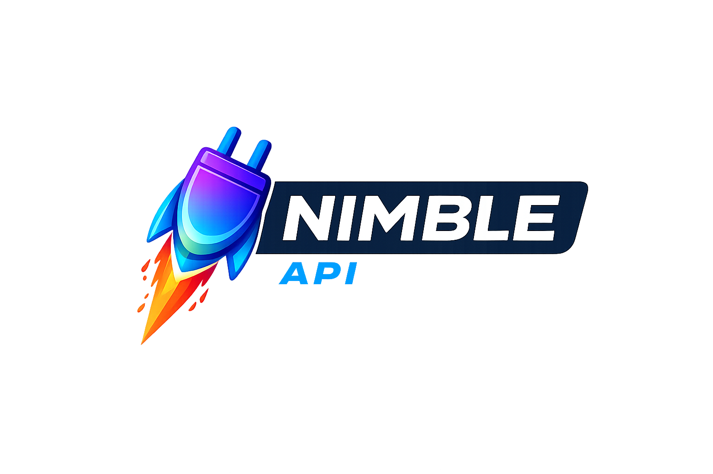

<h1 align="center">
    
    <br/>
    <sub>API route explorer and navigator for Neovim</sub>
</h1>

<p align="center">
  <strong>Browse routes. Jump to handlers. Navigate your API.</strong>
</p>

---

A Neovim plugin for exploring, navigating, and testing API applications. Browse routes in a sidebar explorer, jump to handlers via fuzzy picker, and see CodeLens annotations linking test client calls to their route definitions. Works across multiple web frameworks with a pluggable provider system.

## Supported Frameworks

| Framework                   | Language                | Status                  |
| --------------------------- | ----------------------- | ----------------------- |
| FastAPI                     | 🐍 Python               | :green_heart: Supported |
| Spring / Spring Boot        | ☕ Java                 | :green_heart: Supported |
| Gin / Echo / Chi / http/net | 🐹 Go                   | :green_heart: Supported |
| Express.js                  | JavaScript / TypeScript | 🐢🐢 Planned            |
| Axum                        | 🦀 Rust                 | 🐢🐢🐢 Planned          |
| Ruby on Rails               | 💎 Ruby                 | 🐢🐢🐢 Planned          |

## Features

- **Route Explorer** -- sidebar listing all HTTP routes grouped by source file, with jump-to-definition
- **Fuzzy Picker** -- searchable route list via Telescope, Snacks.nvim, or `vim.ui.select`
- **CodeLens Annotations** -- virtual text on test client calls linking them to their route handler
- **Auto-Refresh** -- debounced file watcher refreshes routes on save
- **Smart Discovery** -- auto-detects framework and app entry point from project files
- **Provider System** -- pluggable architecture makes adding new frameworks straightforward

## Requirements

- Neovim >= 0.10
- [Tree-sitter](https://github.com/nvim-treesitter/nvim-treesitter) parser for the relevant language (`python`, `java`, etc.)
- **Optional:** [telescope.nvim](https://github.com/nvim-telescope/telescope.nvim) or [snacks.nvim](https://github.com/folke/snacks.nvim) for enhanced picker UIs

## Installation

### [lazy.nvim](https://github.com/folke/lazy.nvim)

```lua
{
  "mrpbennett/nimbleapi.nvim",
  cmd = "NimbleAPI",
  dependencies = {
    "nvim-treesitter/nvim-treesitter",
    -- Optional: HTTP client for testing routes
    -- "mistweaverco/kulala.nvim",
  },
  opts = {},
}
```

## Configuration

All options below are shown with their defaults. Pass only what you want to change:

```lua
require("nimbleapi").setup({
  provider = nil,         -- auto-detect; override: "fastapi", "spring"

  explorer = {
    position = "right",    -- "left" or "right"
    width = 40,
    icons = true,         -- requires a Nerd Font
  },

  picker = {
    provider = nil,       -- "telescope", "snacks", or "builtin" (nil = auto-detect)
  },

  keymaps = {
    toggle   = "<leader>Nt", -- toggle explorer sidebar
    pick     = "<leader>Np", -- open route picker
    refresh  = "<leader>Nr", -- refresh route cache
    codelens = "<leader>Nc", -- toggle codelens
    test     = "<leader>Ne", -- test route under cursor

    -- Kulala keymaps (buffer-local on .http files, requires kulala.nvim)
    http_run     = "<leader>Ns", -- send request
    http_replay  = "<leader>NR", -- replay last request
    http_inspect = "<leader>Ni", -- inspect current request
    http_env     = "<leader>NE", -- set environment
  },

  codelens = {
    enabled = true,
    test_patterns = { "test_*.py", "*_test.py", "tests/**/*.py" },
  },

  watch = {
    enabled = true,
    debounce_ms = 200,
  },
})
```

## Usage

### Commands

All commands are available under the `:NimbleAPI` prefix:

| Command               | Description                                  |
| --------------------- | -------------------------------------------- |
| `:NimbleAPI toggle`   | Toggle the explorer sidebar                  |
| `:NimbleAPI pick`     | Open the route picker                        |
| `:NimbleAPI refresh`  | Refresh the route cache                      |
| `:NimbleAPI codelens` | Toggle CodeLens annotations                  |
| `:NimbleAPI test`     | Open HTTP test buffer for route under cursor |
| `:NimbleAPI info`     | Show provider status and diagnostics         |

### Default Keymaps

All keymaps are configurable. Set any keymap to `false` to disable it.

| Keymap       | Action                  | Scope  |
| ------------ | ----------------------- | ------ |
| `<leader>Nt` | Toggle explorer         | Global |
| `<leader>Np` | Open picker             | Global |
| `<leader>Nr` | Refresh routes          | Global |
| `<leader>Nc` | Toggle CodeLens         | Global |
| `<leader>Ne` | Test route under cursor | Global |

### Kulala HTTP Keymaps

When [kulala.nvim](https://github.com/mistweaverco/kulala.nvim) is installed, these keymaps are automatically bound **buffer-locally** in `.http` files. They are only active in HTTP buffers and won't pollute your normal keymap space.

| Keymap       | Action                  |
| ------------ | ----------------------- |
| `<leader>Ns` | Send request            |
| `<leader>NR` | Replay last request     |
| `<leader>Ni` | Inspect current request |
| `<leader>NE` | Set environment         |

All keymaps can be disabled individually by setting them to `false` in your config.

## Explorer Sidebar

The explorer groups routes by source file. The main app file appears first, followed by router files alphabetically. When your active buffer contains routes, the explorer automatically highlights that context.

```
 NimbleAPI (main.py)
──────────────────────────────────────
 main.py
   GET       /              -> root()
   GET       /health        -> health_check()

 routers/items.py
   GET       /items         -> get_all_items()
   POST      /items         -> create_item()
   GET       /items/{id}    -> get_item()
   PUT       /items/{id}    -> update_item()
   DELETE    /items/{id}    -> delete_item()
```

Pressing `<CR>` or `o` on a file header jumps to that file. Pressing it on a route line jumps to the handler definition.

### Explorer Buffer Keymaps

| Key          | Action                   |
| ------------ | ------------------------ |
| `<CR>` / `o` | Jump to route or file    |
| `s`          | Open in horizontal split |
| `v`          | Open in vertical split   |
| `r`          | Refresh routes           |
| `q`          | Close the sidebar        |

## CodeLens Annotations

When CodeLens is enabled and you open a test file matching one of the configured patterns, virtual text annotations appear on test client calls showing the matched handler:

```
client.get("/users/123")  -> get_user() app/routers/users.py:15
```

Press `gd` on an annotated line to jump directly to the route definition.

## App Discovery

### FastAPI (Python)

The plugin locates your FastAPI application in this order:

1. **pyproject.toml** -- reads the `[tool.fastapi]` section for an `app` key
2. **Heuristic scan** -- searches Python files for `FastAPI()` constructor calls, preferring shallower paths

### Spring / Spring Boot (Java)

1. **Dependency detection** -- looks for `spring-boot-starter-web`, `spring-boot-starter-webflux`, `spring-webmvc`, or `spring-web` in `pom.xml` or `build.gradle`
2. **Controller scan** -- falls back to scanning for `@RestController` or `@Controller` annotations
3. **Entry point** -- resolves from `@SpringBootApplication` class, or the first controller found

## Highlight Groups

All highlights ship with sensible defaults and can be overridden in your colorscheme:

| Group                      | Default        |
| -------------------------- | -------------- |
| `NimbleApiMethodGET`       | Green, bold    |
| `NimbleApiMethodPOST`      | Blue, bold     |
| `NimbleApiMethodPUT`       | Yellow, bold   |
| `NimbleApiMethodPATCH`     | Orange, bold   |
| `NimbleApiMethodDELETE`    | Red, bold      |
| `NimbleApiMethodOPTIONS`   | Purple, bold   |
| `NimbleApiMethodHEAD`      | Cyan, bold     |
| `NimbleApiMethodTRACE`     | Gray, bold     |
| `NimbleApiMethodWEBSOCKET` | Teal, bold     |
| `NimbleApiTitle`           | Orange, bold   |
| `NimbleApiRouter`          | Purple, italic |
| `NimbleApiPath`            | Light gray     |
| `NimbleApiFunc`            | Cyan           |

## Diagnostics

Run `:NimbleAPI info` to see a summary of provider status, detection results, and any issues. This is the first place to look when the plugin does not detect your project or a framework is not recognized.

## Contributing

Contributions are welcome. The plugin uses a **provider pattern** that makes adding new framework support straightforward. Each provider lives in its own file under `lua/nimbleapi/providers/` and implements a standard interface for detection, route extraction, and app discovery. Corresponding Tree-sitter queries go in `queries/<language>/`.

See `CLAUDE.md` at the project root for full architecture documentation, the provider interface spec, and a checklist of files to touch when adding a new framework.

## License

MIT
